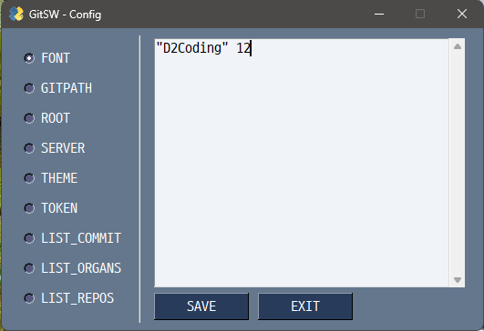

# How to settup

## 1. Install Git_for_Windows

* Download [Git-2.40.1-64-bit.exe](https://github.com/git-for-windows/git/releases/download/v2.40.1.windows.1/Git-2.40.1-64-bit.exe) and install.
* Start `cmd` or `wt`, and type like that :

```cmd
git config --global user.email "<Email_address>"
git config --global user.name "<Username>"
git config --global color.ui auto
git config --global core.editor 'code'
git config --global push.default matching
git config --global init.defaultBranch main
```

## 2. Install Github-CLI

* Download [gh_2.28.0_windows_amd64.msi](https://github.com/cli/cli/releases/download/v2.28.0/gh_2.28.0_windows_amd64.msi) and install.
* Start `cmd` or `wt`, and type like that :

```cmd
setx GH_TOKEN <Github_Token>
gh config set editor "code -w"
gh config set git_protocol https
``` 

* `<Github_Token>` : [Use what created in Github personal access token](https://docs.github.com/ko/authentication/keeping-your-account-and-data-secure/creating-a-personal-access-token)


## 3. Install Anaconda3 or Miniconda3

* Download [Anaconda3-2023.03-1-Windows-x86_64.exe](https://repo.anaconda.com/archive/Anaconda3-2023.03-1-Windows-x86_64.exe) or [Miniconda3-latest-Windows-x86_64.exe](https://repo.anaconda.com/miniconda/Miniconda3-latest-Windows-x86_64.exe)and install.

* **Anaconda** : 3~4GB needed.
* **Miniconda** : 0.3~0.5GB needed.

* Start `Anaconda Prompt (Anaconda3)` or `Anaconda Prompt (Miniconda3)`, and type like that :

```cmd
conda config --add channels conda-forge
conda config --set channel_priority strict
conda config --remove channels defaults
conda config --show channels
conda update --all
```

> By using conda-forge, license restrictions can be circumvented.

[TERMS OF SERVICE](https://legal.anaconda.com/policies/en/?name=terms-of-service)

* Install [PySimpleGUI](https://anaconda.org/conda-forge/pysimplegui)

```cmd
conda install pysimplegui
conda list pysimplegui
```

## 4. Install VScode (Optional)

* Download [System_Installer](https://code.visualstudio.com/download#) and install.

## 5. Install gitsw

* Start `Git CMD`, and type like that :

```cmd
mkdir D:\github
git clone --depth=1 https://github.com/dhkima-higenmotor/gitsw.git D:\github\gitsw
cd /D D:\github\gitsw
```

## 6. Config gitsw

* Start `cmd` or `wt`, and type like that :

```cmd
cd /D D:\github\gitsw
echo <condapath>> condapath
echo <token>> .\Config\token
``` 

* <condapath> : Location of Python (Anaconda or Miniconda)
* <token> : Github personal access token

* Start `config.bat` :



* **FONT** : "Font Name" Size
* **GITPATH** : Location of `git.exe`
* **ROOT** : Root path for local repositories
* **SERVER** : github.com
* **THEME** : GUI theme from [PySimpleGUI Themes](https://raw.githubusercontent.com/PySimpleGUI/PySimpleGUI/master/images/for_readme/ThemePreview.jpg)
* **TOKEN** : Github personal access token
* **LIST_COMMIT** : Reserve commit messages
* **LIST_ORGANS** : Github organizations
* **LIST_REPOS** : Your Repositories
* **SAVE** : Save only current checked

## 6. Test

* Start `gitsw.bat` :
