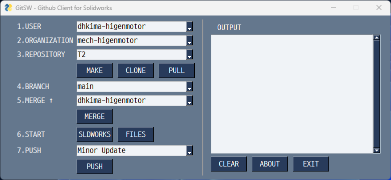

# gitsw

_Github Client for Sloidworks_

## Concept
* Simple & Minimal
* Focus on Solidworks
* Use LFS
* Forced merge (but Risky)
* Co-work other clients (Tortoise-git, git-fork ...)

## Todo
* Debug
* Lock
* Cutout external dependancies
* Improved merge
* Apply Forgejo API

## Manual
* [Manual](Manual/README.md)

